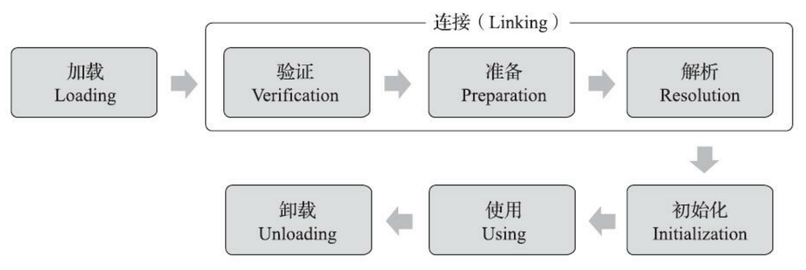

# JavaSE学习笔记

### java环境搭建

1.https://jdk.java.net下载jdk

2.以管理员身份运行命令行

3.cd到jdk文件目录

4.生成jre文件

> bin\jlink.exe --module-path jmods --add-modules java.desktop --output jre 

# 重点知识

## ThreadLocal源码剖析（小部分，有机会深究剩下的）

### 遗留问题

TerminatingThreadLocal.register((TerminatingThreadLocal<?>) this);

具体是怎样清除过期entry的呢？

* 关于怎么算hash的？

```java
private final int threadLocalHashCode = nextHashCode();
//ThreadLocal的成员变量threadLocalHashCode即这个ThreadLocal的hashcode
//在实例化的时候则调用nextHashCode()方法赋值完毕
//因为是final修饰的，所以不可更改，即唯一化了
private static AtomicInteger nextHashCode = new AtomicInteger();
//这个方法会返回当前的类变量(一个AtomicInteger)增加delta之后的值，所以理论上相当均匀
private static int nextHashCode() {
    return nextHashCode.getAndAdd(HASH_INCREMENT);
}
```

* get

```java
public T get() {
    Thread t = Thread.currentThread();
    ThreadLocalMap map = getMap(t);//拿到thread的threadlocals
    if (map != null) {
        ThreadLocalMap.Entry e = map.getEntry(this);
        /**根据key(ThreadLocal)去threadlocals(一个ThreadLocalMap)中寻找value
          *计算index
          *若==则返回，否则向后找，直到为null or ==
          */
        if (e != null) {
            @SuppressWarnings("unchecked")
            T result = (T)e.value;//找到，则返回entry的value
            return result;
        }
    }
    return setInitialValue();//
}
```

```java
private T setInitialValue() {
    T value = initialValue();//初始为null
    Thread t = Thread.currentThread();
    ThreadLocalMap map = getMap(t);
    if (map != null) {
        map.set(this, value);//若threadlocals不为null，则初始化value为null
    } else {
        createMap(t, value);//若threadlocals为null则create(懒初始化)
    }
    //这一段存疑(不知道什么时候会走这里)
    if (this instanceof TerminatingThreadLocal) {
        TerminatingThreadLocal.register((TerminatingThreadLocal<?>) this);
    }
    return value;
}
```

* set

```java
private void set(ThreadLocal<?> key, Object value) {
    // We don't use a fast path as with get() because it is at
    // least as common to use set() to create new entries as
    // it is to replace existing ones, in which case, a fast
    // path would fail more often than not.

    Entry[] tab = table;
    int len = tab.length;
    int i = key.threadLocalHashCode & (len-1);//计算index

    for (Entry e = tab[i];
         e != null;
         e = tab[i = nextIndex(i, len)]) 
    /**
      *循环向后找table的每个槽(slot)上的entry
      *若为null，表示这个位置是空，说明可以放在这儿
      *或者找到key==this的，则更新这个entry的value
      */
    {
        ThreadLocal<?> k = e.get();

        if (k == key) {
            e.value = value;
            return;
        }

        if (k == null) {
            replaceStaleEntry(key, value, i);//替换过期项(Key为null的项)
            return;
        }
    }
	//到这儿的时候i位置slot为null，则我们选这个slot
    tab[i] = new Entry(key, value);
    int sz = ++size;
    if (!cleanSomeSlots(i, sz) && sz >= threshold)
        /**
          *扫描log2(sz)次数，看看是否有value为null的不为null的slot(过期的家伙)
          *若不能清除任何，且长度超过阈值，则rehash
          */
        rehash();
}
```

* 下一个index

```java
/**
 * Increment i modulo len.
 */
private static int nextIndex(int i, int len) {//其实就是对index+1，若超过len则回0
    return ((i + 1 < len) ? i + 1 : 0);
}
```

* rehash

```java
/**
 * Re-pack and/or re-size the table. First scan the entire
 * table removing stale entries. If this doesn't sufficiently
 * shrink the size of the table, double the table size.
 */
private void rehash() {
    expungeStaleEntries();//清除所有过期的entry

    // Use lower threshold for doubling to avoid hysteresis
    if (size >= threshold - threshold / 4)//若size大于槽位的3/4，则resize
        resize();
}
```

## HashMap 源码剖析

```java
public HashMap(int initialCapacity, float loadFactor) {
    if (initialCapacity < 0)
        throw new IllegalArgumentException("Illegal initial capacity: " +
                                           initialCapacity);//初始容量设为0则抛出异常
    if (initialCapacity > MAXIMUM_CAPACITY)
        initialCapacity = MAXIMUM_CAPACITY;//容量不可能超过最大容量，初始容量更不可能
    if (loadFactor <= 0 || Float.isNaN(loadFactor))
        throw new IllegalArgumentException("Illegal load factor: " +
                                           loadFactor);//若负载因子小于等于0或者不是一个数字，抛出异常
    this.loadFactor = loadFactor;
    this.threshold = tableSizeFor(initialCapacity);
}
```

#### 根据初始容量取到大于等于这个值的最小的二次幂

```java
static final int tableSizeFor(int cap) {
    int n = -1 >>> Integer.numberOfLeadingZeros(cap - 1);
    return (n < 0) ? 1 : (n >= MAXIMUM_CAPACITY) ? MAXIMUM_CAPACITY : n + 1;
}
```

#### putVal

```java
final V putVal(int hash, K key, V value, boolean onlyIfAbsent,
               boolean evict) {
    //hash利用key的hashcode
    Node<K,V>[] tab; Node<K,V> p; int n, i;
    if ((tab = table) == null || (n = tab.length) == 0)
        n = (tab = resize()).length;//table为null或者说没有槽位,resize
    if ((p = tab[i = (n - 1) & hash]) == null)//直接跟capacity-1做与运算，比%快，且在capacity为2的整数次幂的时候等效
        tab[i] = newNode(hash, key, value, null);//如果槽位为空，则直接放到这里
    else {//拿到这个槽位
        Node<K,V> e; K k;
        if (p.hash == hash &&
            ((k = p.key) == key || (key != null && key.equals(k))))
            e = p;//如果槽位首个node的hash和我的hash一样，而且是一样的key
        else if (p instanceof TreeNode)
            e = ((TreeNode<K,V>)p).putTreeVal(this, tab, hash, key, value);
        else {
            for (int binCount = 0; ; ++binCount) {
                if ((e = p.next) == null) {
                    p.next = newNode(hash, key, value, null);
                    if (binCount >= TREEIFY_THRESHOLD - 1) // -1 for 1st 
                        treeifyBin(tab, hash);//树化
                    break;
                }
                if (e.hash == hash &&
                    ((k = e.key) == key || (key != null && key.equals(k))))//原本就在里面的话，找到了e
                    break;
                p = e;
            }
        }
        //拿到e，返回oldValue，更新为value
        if (e != null) { // existing mapping for key
            V oldValue = e.value;
            if (!onlyIfAbsent || oldValue == null)
                e.value = value;
            afterNodeAccess(e);
            return oldValue;
        }
    }
    ++modCount;
    if (++size > threshold)
        resize();//resize
    afterNodeInsertion(evict);
    return null;
}
```

#### hash运算

```java
static final int hash(Object key) {
    int h;
    return (key == null) ? 0 : (h = key.hashCode()) ^ (h >>> 16);//用hashcode的高16位与低16位做异或运算，结果为低16位
}
```

#### resize（除了扩容还负责真正的初始化这样的事情）

```java
/**
  *intitcapacity:18
  *tableSizeFor(18)已经变为最小的大于它的二的整数次幂32，并给到threshold
  *我们来看看真实初始化是怎么做的吧
  */
final Node<K,V>[] resize() {
    Node<K,V>[] oldTab = table;
    int oldCap = (oldTab == null) ? 0 : oldTab.length;//0
    int oldThr = threshold;//32
    int newCap, newThr = 0;
    if (oldCap > 0) {
        if (oldCap >= MAXIMUM_CAPACITY) {//已经达到size上限，则不可以再扩容了，直接return旧的table
            threshold = Integer.MAX_VALUE;
            return oldTab;
        }
        else if ((newCap = oldCap << 1) < MAXIMUM_CAPACITY &&
                 oldCap >= DEFAULT_INITIAL_CAPACITY)//double capacity
            newThr = oldThr << 1; // double threshold
    }
    else if (oldThr > 0) // initial capacity was placed in threshold
        newCap = oldThr;//---》32
    else {               // zero initial threshold signifies using defaults
        newCap = DEFAULT_INITIAL_CAPACITY;
        newThr = (int)(DEFAULT_LOAD_FACTOR * DEFAULT_INITIAL_CAPACITY);
        /**
          *如果是无参构造，只赋了负载因子
          *则为16、12
          */
    }
    if (newThr == 0) {
        float ft = (float)newCap * loadFactor;//---》32*0.75计算阈值
        newThr = (newCap < MAXIMUM_CAPACITY && ft < (float)MAXIMUM_CAPACITY ?
                  (int)ft : Integer.MAX_VALUE);//---》24
    }
    threshold = newThr;//给threshold赋为新的threshold
    @SuppressWarnings({"rawtypes","unchecked"})
    Node<K,V>[] newTab = (Node<K,V>[])new Node[newCap];//new一个新的table，size为newCap
    table = newTab;
    if (oldTab != null) {//rehash
        for (int j = 0; j < oldCap; ++j) {
            Node<K,V> e;
            if ((e = oldTab[j]) != null) {
                oldTab[j] = null;
                if (e.next == null)
                    newTab[e.hash & (newCap - 1)] = e;
                else if (e instanceof TreeNode)
                    ((TreeNode<K,V>)e).split(this, newTab, j, oldCap);
                else { // preserve order
                    Node<K,V> loHead = null, loTail = null;
                    Node<K,V> hiHead = null, hiTail = null;
                    Node<K,V> next;
                    do {
                        next = e.next;
                        if ((e.hash & oldCap) == 0) {
                            if (loTail == null)
                                loHead = e;
                            else
                                loTail.next = e;
                            loTail = e;
                        }
                        else {
                            if (hiTail == null)
                                hiHead = e;
                            else
                                hiTail.next = e;
                            hiTail = e;
                        }
                    } while ((e = next) != null);
                    if (loTail != null) {
                        loTail.next = null;
                        newTab[j] = loHead;
                    }
                    if (hiTail != null) {
                        hiTail.next = null;
                        newTab[j + oldCap] = hiHead;
                    }
                }
            }
        }
    }
    return newTab;
}
```

#### 树化

```java
/**
 * Replaces all linked nodes in bin at index for given hash unless
 * table is too small, in which case resizes instead.
 */
final void treeifyBin(Node<K,V>[] tab, int hash) {
    int n, index; Node<K,V> e;
    if (tab == null || (n = tab.length) < MIN_TREEIFY_CAPACITY)
        resize();//为空则要初始化table，capacity小于64，则先别急着treeify，先resize
    else if ((e = tab[index = (n - 1) & hash]) != null) {
        TreeNode<K,V> hd = null, tl = null;
        do {
            TreeNode<K,V> p = replacementTreeNode(e, null);
            if (tl == null)
                hd = p;
            else {
                p.prev = tl;
                tl.next = p;
            }
            tl = p;
        } while ((e = e.next) != null);
        if ((tab[index] = hd) != null)
            hd.treeify(tab);
    }
}
```

## 类加载全部细节



必须初始化类的8种情况（加载、验证、准备显然在这之前）：

1.new一个对象的时候，该对象所属的类必须被初始化

2.访问类变量

3.访问类方法

<font color=Blue>**字节码：new、getstatic、putstatic或invokestatic**</font>

4.运行的程序main函数所在类必须被初始化

5.有父类必须先初始化父类

6.通过反射调用某类时

7.接口实现了default方法，则（可以理解为其是一个父类了）其“子类”初始化时要先初始化它

对比普通的interface只有在真正被使用时才初始化

8.当使用JDK 7新加入的动态语言支持时，如果一个java.lang.invoke.MethodHandle实例最后的解析结果为REF_getStatic、REF_putStatic、REF_invokeStatic、REF_newInvokeSpecial四种类型的方法句柄，并且这个方法句柄对应的类没有进行过初始化，则需要先触发其初始化。（<font color=Red>**这个不懂**</font>）

```java
/**
  * 被动使用类字段演示一：
  * 通过子类引用父类的静态字段，不会导致子类初始化
  **/
  public class SuperClass {
  	static {
  		System.out.println("SuperClass init!");
  	}
  	public static int value = 123;
  }
  public class SubClass extends SuperClass {
  	static {
  	System.out.println("SubClass init!");
  	}
  }
  /**
	* 非主动使用类字段演示
  	**/
  public class NotInitialization {
  	public static void main(String[] args) {
  		System.out.println(SubClass.value);
  	}
  }
```

用到哪个静态字段就初始化哪个类，子类不管（但是hotspot虚拟机子类会被加载）

```java
/**
· * 被动使用类字段演示二：
  * 通过数组定义来引用类，不会触发此类的初始化
  **/
public class NotInitialization {
	public static void main(String[] args) {
		SuperClass[] sca = new SuperClass[10];
	}
}
```

定义对象数组的时候不会初始化，sca[i] = new SuperClass()的时候才会初始化。

这种写法sca每个槽都是null的，没有被初始化。

```java
/**
* 被动使用类字段演示三：
* 常量在编译阶段会存入调用类的常量池中，本质上没有直接引用到定义常量的类，因此不会触发定义常量的
类的初始化
**/
public class ConstClass {
	static {
		System.out.println("ConstClass init!");
	}
	public static final String HELLOWORLD = "hello world";
}
/**
* 非主动使用类字段演示
**/
public class NotInitialization {
	public static void main(String[] args) {
		System.out.println(ConstClass.HELLOWORLD);
	}
}
```

常量通过“常量传播优化”在编译阶段已经被存放到NotInitialization类的常量池中。所以仅仅是使用常量还不会触发类的初始化。

### 加载

职责：

* 通过全限定名获取此类的二进制流
* 将该字节流的静态存储结构转化为方法区的运行时数据结构
* 生成一个该类的Class对象作为方法区这个类的各种数据的访问入口。

### 验证

* 文件格式验证
* 元数据验证
* 字节码验证
* 符号引用验证（解析阶段，将符号引用转化为直接引用的过程中验证）

### 准备

为类变量分配内存并设初始值（默认值）

### 解析


